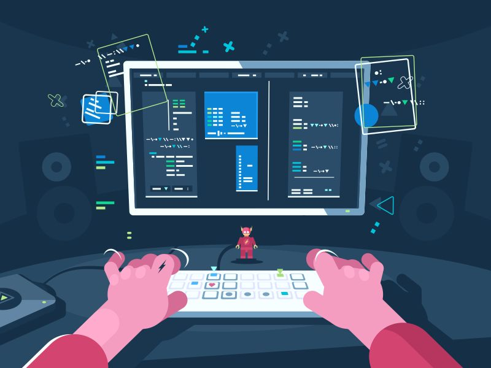
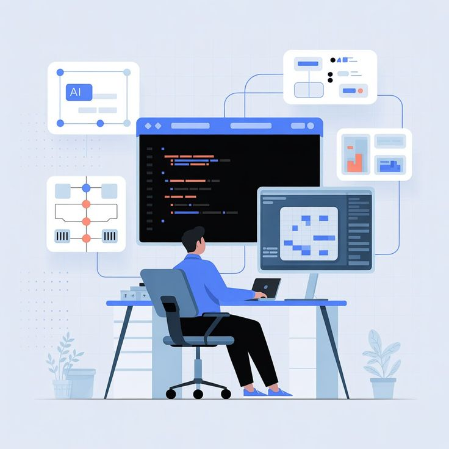

# Ali Bejeli - Frontend Portfolio

Modern portfolio web application built to present frontend engineering work with a product mindset. The project emphasizes responsive UI architecture, polished interaction design, and clear conversion paths (contact + booking), reflecting the execution quality expected in fast-moving fintech teams.

## Project Overview

This portfolio showcases:

- A clear professional narrative (hero, about, strengths, stack, projects, contact)
- A component-first React architecture with reusable motion variants
- Business-oriented project storytelling focused on outcomes (engagement, conversion, operational efficiency)
- A direct scheduling funnel through embedded calendar booking

The goal is to demonstrate not just UI implementation, but product-thinking frontend delivery: translating requirements into an interface that is performant, accessible, and conversion-aware.

## Tech Stack Used

- React 19
- Vite 8
- Tailwind CSS 4
- Framer Motion
- React Icons
- Cal.com Embed (`@calcom/embed-react`)
- ESLint (flat config)

## Key Features

- Sticky, section-aware navigation with smooth scrolling and active section tracking via `IntersectionObserver`
- Responsive multi-section layout optimized for mobile, tablet, and desktop breakpoints
- Reusable animation system (`motionVariants`) for consistent reveal, stagger, and hero transitions
- Interactive tech stack presentation with pointer-based parallax and spring motion
- Project cards with clean visual hierarchy and external portfolio links
- Contact conversion flow with:
  - Email CTA
  - LinkedIn CTA
  - Embedded Cal.com booking widget for scheduling
- Scroll-to-top utility button with visibility logic based on scroll position

## Screenshots

> Replace these with full-page captures from your deployed site for the strongest hiring impact.

### Hero Section



### About Section



## How to Run Locally

### 1) Clone and install

```bash
git clone <your-repo-url>
cd my-portfolio-main
npm install
```

### 2) Start development server

```bash
npm run dev
```

Open the local URL shown by Vite (typically `http://localhost:5173`).

### 3) Build for production

```bash
npm run build
```

### 4) Preview production build

```bash
npm run preview
```

## What I Learned / Challenges Solved

- Built robust section navigation behavior that stays accurate across scroll, hash changes, and direct in-page links
- Balanced visual richness and maintainability by centralizing motion tokens/variants instead of scattering animation configs
- Improved UX continuity with responsive spacing, typography scaling, and consistent visual rhythm across sections
- Integrated a third-party booking experience (Cal.com) while preserving on-brand styling and clean layout constraints
- Strengthened product communication by framing projects around measurable outcomes, not just technical implementation

## Why This Matters for Fintech Teams

Fintech products require trust, clarity, speed, and precision. This project demonstrates:

- Clean, scalable frontend implementation patterns
- UX decisions that support user confidence and conversion
- Strong alignment between technical execution and business outcomes
- Communication style that works across engineering, product, and design
